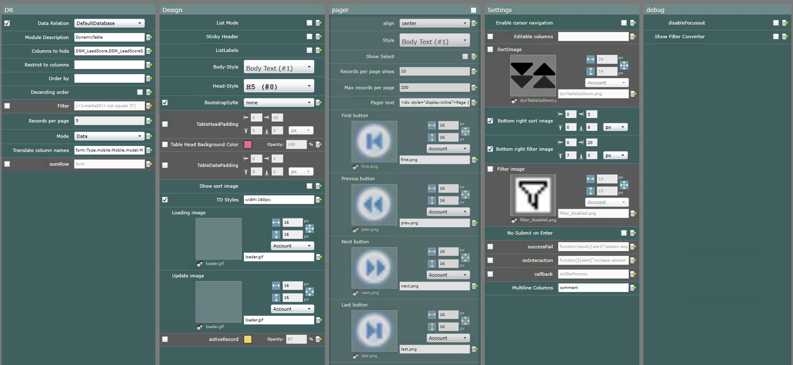

# DynamicTable
DirectSmile Cross Media Extension to view and/or edit Data Relations or the primary database (requires admin rights). It loads data via the AJAX DSMX API, supports inline editing, filtering and sorting.

## Install
To install, download the DynamnicTable.zip and import it in DirectSmile Cross Media in the Extension Items browser.

## Dependencies:
- DSMX v 7

- dsmxapi -> https://github.com/nihiels/dsmxapi

## Item Parameters

### DR Parameters
- DR (Data Relation)<br />
  Data Relation that should be loaded. If deactivated, the primary DB will be displayed
- Columns to hide<br />
  Comma separated string to specify columns that should not be displayed
- Restrict to columns<br />
  Comma separated string to define which columns are to be loaded
- Order by<br />
  Comma separated string to define sort orders
- Descending Order<br />
  If checked, the order will be descending
- Filter<br />
  A filter can be specified here. The filter must be formatted like the DSMX Web API is expecting it. ((<|FirstName|> = '') And ((<|xmediaID|> > '2') Or (<|xmediaID|> = '2')))
  <b>Hint:</b> The X-Item provides a filter converter that makes it very easy to convert Data Relation Filter to the expected format.<br />
  <b>Attention:</b> Filters, defined as a parameter here are visible in the source code of the web site and can be manipulated. Security relevant filters must be specified in the data relation.
- Records per page<br />
  Defines the number of records to load and display.
- Mode<br />
  Can be distinct or data. To support distinct output, the source relation has to be created in distinct mode as well.
- Translate column names<br />
  Her you can specify translations for the column names. It expects a comma and double point separated string like this: column1:trans1,column2:trans2
- sumRow<br />
  If activated the item will render an additional row where all columns that contain numbers are summed up. If the parameter contains a comma separated string, it should display these strings at the particular index in the sum row.
### Design Parameters
- List Mode<br />
  If activated, the item will render an HTML list instead of a table.
- Sticky header<br />
  If activated and the item is running not in List Mode, the table head row will follow the scroll position if the table is larger than the window.
- List Labels<br />
  If the item is running in List Mode and List Labels is activated, Column names or their translations will be displayd as labels for each list value.
- Body-Style and Head-Style<br />
  DSMX Styles can be selected here.
- BootstrapStyle<br />
  DSMX v7 provides Bootstrap 3.3.5 as included CSS library for extension items. So I implemented a parameter to choose the Bootstrap table style here.
- TableHeadPadding<br />
  If table filtering and/or sorting is activated, this setting is useful to define a margin for the sort and/or filter images.
- Table Head Background Color<br />
  Set the background color of your table head.
- Table Data Padding<br />
  Defines a padding for each data cellLabel.
- Show sort images<br />
  When activated and Sorting in Setttings is activated, the sort image will be shown without mouse over.
- TD Styles<br />
  This parameter expects a comma separated string for inline css style declarations.
  ```
    {stylesColumn1},{stylesColumn2}
  ```
- Loading image<br />
  This image will be shown while the data is loaded from the server.
- Update Image<br />
  Will be shown when updating a record.
- active Record<br />
  defines the table row background color of a selected record
### Pager Parameters
Activate the parameter group to render a page navigation that supports the following parameters and features:
- Align<br />
  Configure the alignment of the pager container (left, center or right).
- Style<br />
  Choose a dsmx style for the pager container here.
- Show Select<br />
  Renders a select element, where users can select the records per page number.
- Records per page steps<br />
  Defines the steps of the records per page selector.
- Max records per page<br />
  The maximum number the select item should show.
- Pager text<br />
  Any HTML code to view the pager text. it Supports placeholders for the following numbers:
  ```html
    <div style="display:inline">
      Page {p} of {mp}; Records {x} to {y} from {all}
    </div>      
  ```
  <b>make sure your markup is just one line (The X-Item parameter doesn't like line breaks)</b>
- First, Previous, Next and Last buttons<br />
  Choose button images here.
### Settings Parameters
- Enable cursor navigation<br />
  Activate this checkbox to enable cursor navigation for the inline editing feature. It allows to navigate the cursor with the keyboard arrow keys.
- Editable columns<br />
  When activated and no columns are specified, all visible cells are editable. To restrict edit ability, type in column names, comma separated.
- Sort Image<br />
  Enable this checkbox to make each column sortable.
- Bottom right sort image<br />
  Defines the position of the image from bottom right. Therefore other values will be ignored.
- Bottom right filter image<br />
  Defines the position of the image from bottom right. Therefore other values will be ignored.
- Filter image<br />
  Activate this box to let users define their own filters. The filter is searching with 'contains' and will be combined with other defined filters.
- No submit on enter<br />
  Overwrite the default button function of DSMX to do nothing.
- SuccessFail<br />
  Javascript fail callback function for API errors of loading or updating via DSMX Web API
- onInteraction<br />
  Javascript callback function for interactions like paging or updating records.
- callback<br />
  Javascript callback function for when the item is loaded and rendered completely.
- Multiline Columns<br />
  Comma separated string to define columns that should support content with line breaks for inline editing.

### Debug Parameters
- disableFocusout<br />
If activated, the focusout event wont get fired when inline editing is active. It's meant to inspect the text input when editing data with any web developer tool.
- Show Filter Converter<br />
If activated, the item will render two text areas. You can paste any created Data Relation filter (of the DSMX DR Filter Configurator) into the first area. The second area will show the converted filter that can be pasted into the filter parameter field of the extension item. Please use the Data Relation that is configured for the item to create filters. Otherwise the field names are not replaced correctly.

## Custom Content
Custom content features:
The X-Item contains a sub item that describes the custom content with html elements in a div with the class customContent...
```html
<div class="customContent">
  <div data-pos="0" data-label="">
    <div class="btn-group" >
      <button data-action="delete" data-confirm="Do you really want to delete this record?" class="btn btn-danger" >
        x
      </button>
      <a heiopei="[[RootURL]][[CampaignName]]@[[PageName]]/[[LpLogin]]?{{dr}}_id=<|xmediaID|>"
        class="btn btn-default">
        select
      </a>
    </div>
  </div>
  <div data-pos="top" data-label="">
    <div class="btn-group" style="margin-bottom:20px;">
      <button data-params="" class="btn btn-default" data-action="add" data-title="new record" data-width="400" data-btn-caption="Create">
        new record
      </button>
    </div>
  </div>
</div>
```
### Costom Content supported attributes:
- data-pos<br />
describes the position of the custom content. If it's a number, the content will be rendered in each row at the index of this number. 0 stands for the first column
- data-action and data-change<br />
First will init a click listener, while the second will init a change listener that can have different actions:
    - add<br />
    opens a new record form according to the data-params JSON string. If data-params is empty, the form will render a text input field for every available column.
    The object of the JSON string should be structured like this:
    ```javascript
    {
      [ColumnName]:{
        "attrs":{
          "type": "text",
          "placeholder":'string',
          "id":ColumnName,
          "class":"form-control",
          "name":ColumnName,
          "data-validation":'notempty'//can be notempty or email so far.
        },
        "label":{
          "attrs":{
            "text":ColumnName,
            "for":ColumnName
          }
        }
      }
    };
    ```
    - update<br />
    updates the current record via AJAX. Column names and values will be specified within the custom content HTML attributes:
    ```html
      <button
        data-updatecol="columns1,column2,..."
        data-updateval="value1,value2,...">
          update
      </button>      
    ```
    or if it's a select field, the function will search for the selected option.
    - delete<br />
      Will delete the current record via AJAX and remove the table row from DOM.
- data-success<br />
    Here you can specify the function name that should be executed after completing the actions of this custom content element. The function will have the custom content element as first parameter and if it was an add action, the added record table object as second and the table ID as third parameter.
- data-confirm<br />
  If this parameter is specified, the action will need a user confirmation. The Question for the confirmation can be defined as parameter value:
  ```html
    <button
      data-confirm="Do you really want to do this?">
        I need confirmation
    </button>      
  ```
- data-con<br />
  This parameter describes the condition on which this custom content element will be displayed or hidden. The script expects an expression in the parameter:
  ```html
    <button
      data-con="'<|datarelationField|>' === '[[PrimaryRecordField]]'">
        I will be displayed when the expression in my data-con param is true
    </button>      
  ```
- data-each<br />
  expects a function name that will be executed for this element or these elements. The funciton will get the element as parameter.
  ```html
    <button
      data-each="myEach">
        I have a function name that will be executed for me.
    </button>      
  ```
  The function could look like this:
  ```javascript
    function myEach(elem){
      $(elem).click(function(){
        console.log("each item has been clicked");
      });
    }      
  ```
- data-hide and data-show<br />
  This parameter is meant to hide and show other DOM elements. It expects a selector as parameter value:
  ```html
    <button
      data-hide=".was-here"
      data-show=".was-not-here">
        Clicking me will hide all DOM elements with the CSS class "was-here" and show all elements with "was-not-here"
    </button>      
  ```
